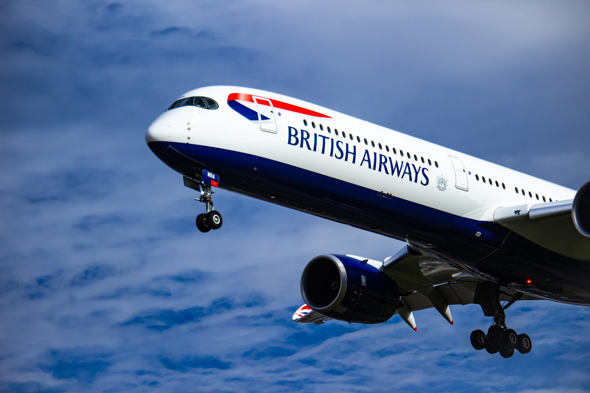

# British Airlines reviews analysis

# Tools and libraries

<li><a href="https://jupyter.org/">Jupiter notebook</a></li>
<li><a href="https://scikit-learn.org/stable/#">Scikit_Learn</a></li>
<li><a href="https://pandas.pydata.org/">Pandas</a></li>
<li><a href="https://www.crummy.com/software/BeautifulSoup/bs4/doc/">BeautifulSoup</a></li>
<li><a href="https://seaborn.pydata.org/#">Seaborn</a></li>

## Dataset

https://www.airlinequality.com/airline-reviews/british-airways

## Visualizations:

tbd
